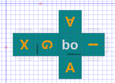

# nrd-GAIAboX

`gbx` as prefix, shortcut or namespace to GAIAboX.

## GAIAboX "File Transfer Protocol" (FTP)

[GAIAboX "File Transfer Protocol" (`gbx.ftp`)](./gbx.ftp/README.md).

## GAIAboX "linked Data Platform" (LDP)

[GAIAboX "linked data platform" (`gbx.ldp`)](./gbx.ldp/README.md).

## GAIAboX "Binary Operator as a Service" (BOaaS)

[Here](./gbx.P/BO).

---

## GAIAboX "solid"

[GAIAboX "solid" (`gbx.solid`)](./gbx.solid/README.md).

## GAIAboX "Do It Yourself"

[GAIAboX "do it yourself" (`gbx.DIY`)](./DIY/README.md).

---