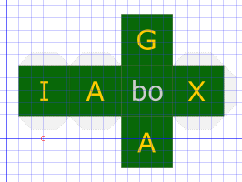

# nrd-GAIAboX

`gbx` as prefix, shortcut or namespace to GAIAboX.

## GAIAboX "file transfer protocol"

[GAIAboX "file transfer protocol" (`gbx.ftp`)](./gbx.ftp/README.md).

## GAIAboX "linked data platform"

[GAIAboX "linked data platform" (`gbx.ldp`)](./gbx.ldp/README.md).

## GAIAboX "solid"

[GAIAboX "solid" (`gbx.solid`)](./gbx.solid/README.md).

---